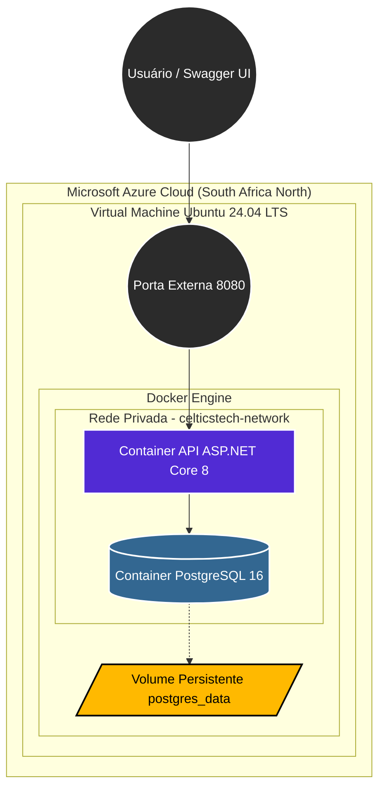

# Celticstech - Sistema de Gestão e Recomendação Agrícola

## Sobre o Projeto

O **Celticstech** é uma plataforma desenvolvida para auxiliar associações agrícolas da região Nordeste do Brasil no gerenciamento de cultivos e na geração automatizada de recomendações técnicas para produtores rurais.

A solução foi projetada seguindo os princípios da **Cultura DevOps**, utilizando infraestrutura em nuvem, conteinerização, automação de deploy e persistência de dados para garantir:

* Escalabilidade
* Alta disponibilidade
* Segurança
* Padronização de ambientes
* Facilidade de manutenção
* Entrega contínua

O projeto foi implantado em ambiente cloud utilizando recursos da Microsoft Azure e tecnologias modernas de desenvolvimento e infraestrutura.

---

# Sumário

* [Arquitetura da Solução](#arquitetura-da-solução)
* [Tecnologias Utilizadas](#tecnologias-utilizadas)
* [Infraestrutura Cloud](#infraestrutura-cloud)
* [Práticas DevOps Implementadas](#práticas-devops-implementadas)
* [Segurança da Aplicação](#segurança-da-aplicação)
* [Persistência de Dados](#persistência-de-dados)
* [Guia de Implantação](#guia-de-implantação)
* [Auditoria do Ambiente](#auditoria-do-ambiente)
* [Validação Funcional](#validação-funcional)
* [Encerramento do Ambiente](#encerramento-do-ambiente)
* [Equipe](#equipe)

---

# Arquitetura da Solução

A arquitetura foi desenvolvida para executar integralmente em ambiente cloud, utilizando uma Máquina Virtual Linux hospedada na Microsoft Azure.

A comunicação entre os componentes ocorre através de uma rede Docker privada, permitindo isolamento dos serviços e maior segurança operacional.



---

# Tecnologias Utilizadas

## Backend

* ASP.NET Core 8
* Entity Framework Core
* Swagger/OpenAPI

## Banco de Dados

* PostgreSQL 16

## Conteinerização

* Docker
* Docker Compose

## Cloud Computing

* Microsoft Azure
* Azure CLI

## Sistema Operacional

* Ubuntu Server 24.04 LTS

## Controle de Versão

* Git
* GitHub

---

# Infraestrutura Cloud

A infraestrutura foi provisionada em ambiente Microsoft Azure utilizando linha de comando através do Azure CLI.

### Recursos Provisionados

| Recurso             | Descrição                 |
| ------------------- | ------------------------- |
| Virtual Machine     | Hospedagem da aplicação   |
| Ubuntu 24.04 LTS    | Sistema operacional       |
| Docker Engine       | Execução dos containers   |
| Docker Compose      | Orquestração dos serviços |
| PostgreSQL          | Persistência de dados     |
| Rede Virtual Docker | Comunicação interna       |

---

# Práticas DevOps Implementadas

## Infraestrutura como Código (IaC)

Provisionamento dos recursos cloud através do Azure CLI.

## Conteinerização

Empacotamento da aplicação utilizando Docker para garantir consistência entre ambientes.

## Orquestração

Gerenciamento dos serviços através do Docker Compose.

## Automação de Deploy

Construção automática das imagens durante o processo de implantação.

## Ambientes Reproduzíveis

Toda a aplicação pode ser reconstruída utilizando apenas os arquivos presentes neste repositório.

---

# Segurança da Aplicação

## Multi-Stage Build

O Dockerfile utiliza múltiplos estágios para separar compilação e execução.

Benefícios:

* Redução do tamanho da imagem
* Menor superfície de ataque
* Remoção de artefatos desnecessários

## Execução Rootless

A aplicação executa utilizando um usuário não privilegiado.

```bash
whoami
app
```

Benefícios:

* Redução de riscos de escalonamento de privilégios
* Maior proteção contra comprometimento do container

## Isolamento de Rede

O banco PostgreSQL não possui portas expostas para acesso externo.

Toda comunicação ocorre exclusivamente pela rede interna:

```text
celticstech-network
```

---

# Persistência de Dados

A persistência é garantida através do volume Docker:

```text
postgres_data
```

Dessa forma os dados permanecem armazenados mesmo após:

* Reinicialização dos containers
* Atualizações da aplicação
* Recriação dos serviços
* Falhas operacionais

---

# Guia de Implantação

## 1. Conectar na Máquina Virtual

```bash
ssh celticsadmin@20.87.243.184
```

## 2. Clonar o Repositório

```bash
git clone https://github.com/joaovendrameto05/Celticstech-1.git

cd Celticstech-1
```

## 3. Executar a Aplicação

```bash
sudo docker-compose up --build -d
```

## 4. Validar Containers

```bash
sudo docker ps
```

Resultado esperado:

```text
celticstech-api-561450
postgres-db-561450
```

---

# Auditoria do Ambiente

## Verificar Logs da API

```bash
sudo docker logs celticstech-api-561450
```

## Verificar Logs do Banco

```bash
sudo docker logs postgres-db-561450
```

## Inspecionar o Container da API

```bash
sudo docker exec -it celticstech-api-561450 bash
```

Dentro do container:

```bash
pwd
ls -l
whoami
```

Validações esperadas:

```text
/app
```

```text
app
```

---

# Validação Funcional

## Swagger

A aplicação pode ser acessada através do endereço:

```text
http://20.87.243.184:8080
```

---

## CREATE

Criar registros utilizando:

```http
POST /api/Regioes
POST /api/Cultivos
```

Validar no PostgreSQL:

```sql
SELECT * FROM "Regioes";
SELECT * FROM "Cultivos";
```

---

## READ

Consultar registros:

```http
GET /api/Regioes
GET /api/Cultivos
```

---

## UPDATE

Atualizar informações:

```http
PUT /api/Cultivos/{id}
```

Validar:

```sql
SELECT * FROM "Cultivos";
```

---

## DELETE

Remover registros:

```http
DELETE /api/Cultivos/{id}
```

Validar:

```sql
SELECT * FROM "Cultivos";
```

---

# Acesso ao PostgreSQL

```bash
sudo docker exec -it postgres-db-561450 \
psql -U postgres -d CelticstechDb
```

Para sair:

```sql
\q
```

---

# Encerramento do Ambiente

Paralisar todos os serviços:

```bash
sudo docker-compose down -v
```

Encerrar sessão SSH:

```bash
exit
```

---

# Equipe

| Nome                           | RM       | Turma  |
| ------------------------------ | -------- | ------ |
| João Victor Vendrameto         | RM563665 | 2TDSPV |
| Nicolas de Oliveira Jacob      | RM564205 | 2TDSPX |
| Gabriel Ambrósio Saraiva       | RM566552 | 2TDSPV |
| Vinicius Romaguera Cardozo     | RM562308 | 2TDSPX |
| Yuri Fuzinatto Garzoli Barreto | RM561450 | 2TDSPX |

---

# Considerações Finais

Este projeto foi desenvolvido como atividade integradora das disciplinas de **DevOps Tools** e **Cloud Computing**, contemplando conceitos de:

* Infraestrutura em Nuvem
* Conteinerização
* Orquestração de Serviços
* Persistência de Dados
* Segurança de Containers
* Automação de Deploy
* Cultura DevOps

Toda a infraestrutura foi provisionada, implantada e validada em ambiente Microsoft Azure, seguindo boas práticas de arquitetura moderna para aplicações distribuídas.
